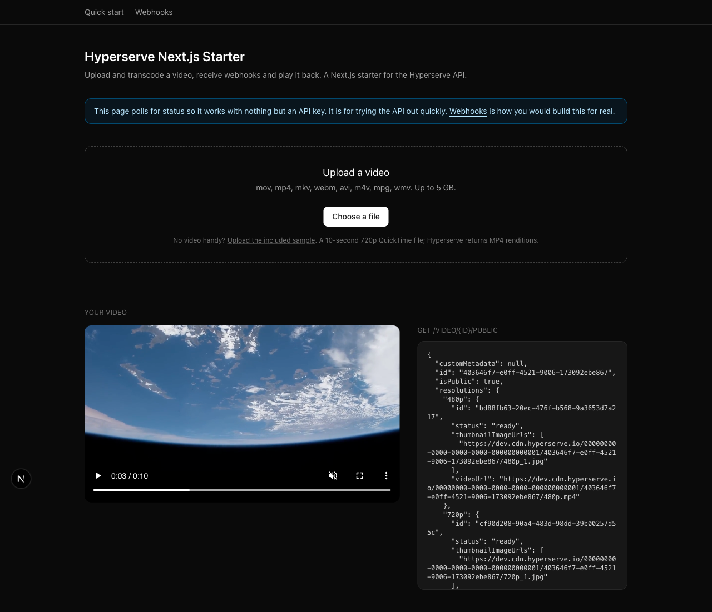

# Hyperserve Next.js Starter

Upload and transcode a video, receive webhooks and play it back. A Next.js
starter for the [Hyperserve](https://hyperserve.io) API.



Paste in a Hyperserve API key and it works.

## Quick start

Node 20.9 or newer, which is what Next.js 16 requires.

```bash
git clone https://github.com/hyper-serve/hyperserve-nextjs-starter
cd hyperserve-nextjs-starter
npm install
cp .env.example .env.local
```

Put your API key in `.env.local`. Create one at
[hyperserve.io/api-keys](https://hyperserve.io/api-keys):

```
HYPERSERVE_API_KEY=your-key-here
```

Then `npm run dev` and open [localhost:3000](http://localhost:3000). Choose a
video, or hit **Upload the included sample** to use the bundled `sample.mov`,
a 10-second clip of NASA ISS Earth-observation footage (public domain).

## Two demos

The upload is identical in both. They differ only in how they learn the video is
ready.

| Page | How it knows | Setup needed |
|---|---|---|
| [`/`](http://localhost:3000) | Polls `getVideo` until `status` is `ready` | Just an API key |
| [`/webhooks`](http://localhost:3000/webhooks) | Reads the URL out of the webhook payload | A public URL and a registered webhook |

**Build with webhooks.** Hyperserve tells you the moment transcoding finishes and
the payload already contains a playable `videoUrl` per resolution, so you store
it and never poll. The quickstart exists so you can try the API without
stopping to set up a tunnel and webhook, and because polling is still the right
answer for a script or a job that cannot receive an HTTP callback.

## Uploading a video

Three calls. Your API key stays on the server.

**1. Initialize creating a video and get a presigned upload URL**, server-side, in
[`app/api/videos/route.ts`](app/api/videos/route.ts):

```typescript
const { id, uploadUrl, contentType } = await hyperserve.createVideo({
  filename: "sample.mov",
  resolutions: ["720p", "480p"],
  isPublic: true,
});
```

**2. Upload the file to the storage bucket**, in the browser, in
[`components/upload-panel.tsx`](components/upload-panel.tsx). `contentType` must
be exactly what `createVideo` returned or the presigned upload URL rejects the request:

```typescript
import { putVideoToStorage } from "@hyperserve/hyperserve-js/browser";

await putVideoToStorage({ uploadUrl, contentType, file, onProgress: setPercent });
```

**3. Complete the create video process when the video has uploaded**, this queues for transcoding. Server-side
again, in
[`app/api/videos/[id]/complete/route.ts`](app/api/videos/%5Bid%5D/complete/route.ts):

```typescript
await hyperserve.completeUpload(id);
```

See [file limits](https://docs.hyperserve.io/guides/working-with-videos/file-limits)
for accepted formats and maximum size.

## Knowing when a video is ready

Transcoding is asynchronous, so the upload call returns before there is anything
to play.

**With webhooks**, Hyperserve POSTs when it finishes and the payload carries a
ready `videoUrl` per resolution, plus the `customMetadata` you can pass to
`createVideo`. Update your database with the webhook payload data and you're
done. See
[`components/webhook-video-panel.tsx`](components/webhook-video-panel.tsx), which
never calls `getVideo`.

**Without webhooks**, poll `getVideo` until `status` is `ready` or `fail`. That is
[`components/polling-video-panel.tsx`](components/polling-video-panel.tsx):

```typescript
const video = await hyperserve.getVideo(id);
// video.status              -> "pending_upload" | "processing" | "ready" | "fail"
// video.resolutions["720p"] -> { status, videoUrl, thumbnailImageUrls }
```

`getVideo` is also how you get a fresh signed URL for a private video, which a
webhook cannot give you because signed URLs expire.

## Receiving webhooks

Hyperserve posts an event when transcoding finishes. That needs a publicly
reachable URL, so you'll need to expose your dev server with a tunneling
service. Cloudflare quick tunnels works great with no account:

```bash
npx cloudflared tunnel --url http://localhost:3000
```

That prints a URL like `https://something-random.trycloudflare.com`. Then:

1. Go to [hyperserve.io/webhooks](https://hyperserve.io/webhooks), create your
   webhook, and enter that URL with `/api/hyperserve/webhook` appended.
2. Copy the signing secret into `.env.local` as `HYPERSERVE_WEBHOOK_SECRET` and
   restart the dev server.
3. Upload a video. When transcoding finishes the event appears in the
   **Webhooks** section of the page, with its payload and whether the signature
   verified.

The webhook receiver is
[`app/api/hyperserve/webhook/route.ts`](app/api/hyperserve/webhook/route.ts):

```typescript
export async function POST(request: Request) {
  // Read the raw text, required for a verified signature
  const rawBody = await request.text();

  const verified = await verifyWebhookSignature({
    signature: request.headers.get("x-hyperserve-signature") ?? "",
    secret: process.env.HYPERSERVE_WEBHOOK_SECRET ?? "",
    body: rawBody,
  });

  // Non-2xx makes Hyperserve retry, which is what you want.
  if (!verified) {
    return NextResponse.json({ error: "Invalid signature." }, { status: 401 });
  }

  const { event, videoId, data } = JSON.parse(rawBody);
  // event is "video-processing-success" or "video-processing-fail"
  // data.resolutions["720p"].videoUrl is playable now for a public video
}
```

## Using this in your own app

Here's the integration steps in order. Everything runs on your server except file upload which goes direct to storage.

| # | Do this | Runs in | Copy from |
|---|---|---|---|
| 1 | `createVideo`: get an `id`, a presigned `uploadUrl` and a `contentType` | Server | [`app/api/videos/route.ts`](app/api/videos/route.ts) |
| 2 | `putVideoToStorage`: upload the video to `uploadUrl` with that exact `contentType` | **Browser** | [`components/upload-panel.tsx`](components/upload-panel.tsx) |
| 3 | `completeUpload`: tell Hyperserve the video finished uploading, which queues transcoding | Server | [`app/api/videos/[id]/complete/route.ts`](app/api/videos/%5Bid%5D/complete/route.ts) |
| 4 | `verifyWebhookSignature`: receive the event that says transcoding finished | Server | [`app/api/hyperserve/webhook/route.ts`](app/api/hyperserve/webhook/route.ts) |
| 5 | `getVideo`: only if you cannot use webhooks, or need a signed URL for a private video | Server | [`app/api/videos/[id]/route.ts`](app/api/videos/%5Bid%5D/route.ts) |

Step 2 imports from `@hyperserve/hyperserve-js/browser`, which carries no API-key
code and is safe to bundle. Everything else imports from
`@hyperserve/hyperserve-js` and must stay server-side.

Steps 1 to 4 are the whole integration. Step 5 is the alternative for when a
webhook cannot reach you, and the method for getting signed private video URLs at runtime.

## Notes

This is a reference integration, not a production app. It has no
authentication, so a deployed instance is an open upload proxy: anyone with the
URL can upload to your Hyperserve account.

Every video is uploaded as public (`isPublic: true`). For private videos, use
`hyperserve.getVideo(id, { private: true, expirationSeconds: 3600 })` to get
time-limited signed URLs.

The page prints the raw API response next to the player, so don't put anything
private in `customMetadata`.

## Deploying

[](https://vercel.com/new/clone?repository-url=https%3A%2F%2Fgithub.com%2Fhyper-serve%2Fhyperserve-nextjs-starter&project-name=hyperserve-nextjs-starter&repository-name=hyperserve-nextjs-starter&env=HYPERSERVE_API_KEY&envDescription=Your%20Hyperserve%20API%20key%20%28HYPERSERVE_WEBHOOK_SECRET%20is%20optional%2C%20add%20it%20later%20in%20project%20settings%29&envLink=https%3A%2F%2Fhyperserve.io%2Fapi-keys)

## License

MIT
